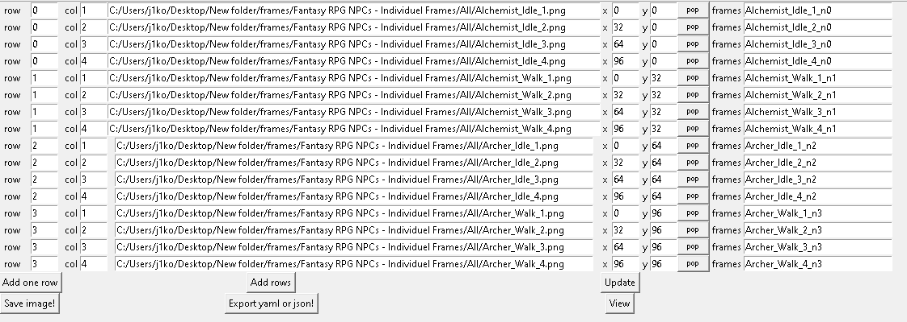

# SpriteSheetMaker
A simple python Sprite sheet maker. It takes separate images and plans them on a new image. Can also export json and yaml files. I make this for my needs.

~~Maybe will update it in the future~~


[comment]: <> (![image]&#40;https://user-images.githubusercontent.com/59426055/125518065-cddf3792-cf36-4d44-a761-4b3b562d3830.png&#41;)

***

### Hotkeys: 


F1 = lets you choose a single image and add it into the row (add one row).  
F2 = lets you choose a multiple images and add them into the rows (add rows).  
F5 = updates 'x' and 'y' cells.  

***

'row' is the rows of images, 'col' is for the corresponding columns.  
Separate frames (frames) is for the nested dict/json/yaml.

The other fields are auto generated. You can tweek them.


***
## USEGE:

Edit the **row**, **col** and **separate frames (frames)**.  
You can change the **x** and **y** value for extra tweeking.


[comment]: <> (### EXAMPLE:)

[comment]: <> (##### The image below will produce this yaml file:)


[comment]: <> (![image]&#40;https://user-images.githubusercontent.com/59426055/125518713-f3f960ae-23ca-468c-bcfc-29dbfe647089.png&#41;)

[comment]: <> (```yaml)

[comment]: <> (Bandit_Idle_1_n0:)

[comment]: <> (  Bandit_Idle_1.png0:)

[comment]: <> (    x: ['32', '64'])

[comment]: <> (    y: ['0', '32'])

[comment]: <> (Bandit_Idle_2_n0:)

[comment]: <> (  Bandit_Idle_2.png1:)

[comment]: <> (    x: ['64', '96'])

[comment]: <> (    y: ['0', '32'])

[comment]: <> (Bandit_Idle_3_n0:)

[comment]: <> (  Bandit_Idle_3.png2:)

[comment]: <> (    x: ['96', '128'])

[comment]: <> (    y: ['0', '32'])

[comment]: <> (Bandit_Idle_4_n0:)

[comment]: <> (  Bandit_Idle_4.png3:)

[comment]: <> (    x: ['128', '160'])

[comment]: <> (    y: ['0', '32'])

[comment]: <> (Bandit_Walk_1_n1:)

[comment]: <> (  Bandit_Walk_1.png4:)

[comment]: <> (    x: ['32', '64'])

[comment]: <> (    y: ['32', '64'])

[comment]: <> (Bandit_Walk_2_n1:)

[comment]: <> (  Bandit_Walk_2.png5:)

[comment]: <> (    x: ['64', '96'])

[comment]: <> (    y: ['32', '64'])

[comment]: <> (Bandit_Walk_3_n1:)

[comment]: <> (  Bandit_Walk_3.png6:)

[comment]: <> (    x: ['96', '128'])

[comment]: <> (    y: ['32', '64'])

[comment]: <> (Bandit_Walk_4_n1:)

[comment]: <> (  Bandit_Walk_4.png7:)

[comment]: <> (    x: ['128', '160'])

[comment]: <> (    y: ['32', '64'])

[comment]: <> (```)

[comment]: <> (##### This will produse:)

[comment]: <> (![image]&#40;https://user-images.githubusercontent.com/59426055/125518916-53430e84-a8a9-4d18-bdde-4a693536e5dc.png&#41;)


[comment]: <> (```yaml)

[comment]: <> (frame1:)

[comment]: <> (  Bandit_Idle_1.png0:)

[comment]: <> (    x: ['32', '64'])

[comment]: <> (    y: ['0', '32'])

[comment]: <> (  Bandit_Idle_2.png1:)

[comment]: <> (    x: ['64', '96'])

[comment]: <> (    y: ['0', '32'])

[comment]: <> (  Bandit_Idle_3.png2:)

[comment]: <> (    x: ['96', '128'])

[comment]: <> (    y: ['0', '32'])

[comment]: <> (  Bandit_Idle_4.png3:)

[comment]: <> (    x: ['128', '160'])

[comment]: <> (    y: ['0', '32'])

[comment]: <> (  Bandit_Walk_1.png4:)

[comment]: <> (    x: ['32', '64'])

[comment]: <> (    y: ['32', '64'])

[comment]: <> (  Bandit_Walk_2.png5:)

[comment]: <> (    x: ['64', '96'])

[comment]: <> (    y: ['32', '64'])

[comment]: <> (  Bandit_Walk_3.png6:)

[comment]: <> (    x: ['96', '128'])

[comment]: <> (    y: ['32', '64'])

[comment]: <> (  Bandit_Walk_4.png7:)

[comment]: <> (    x: ['128', '160'])

[comment]: <> (    y: ['32', '64'])

[comment]: <> (```)
